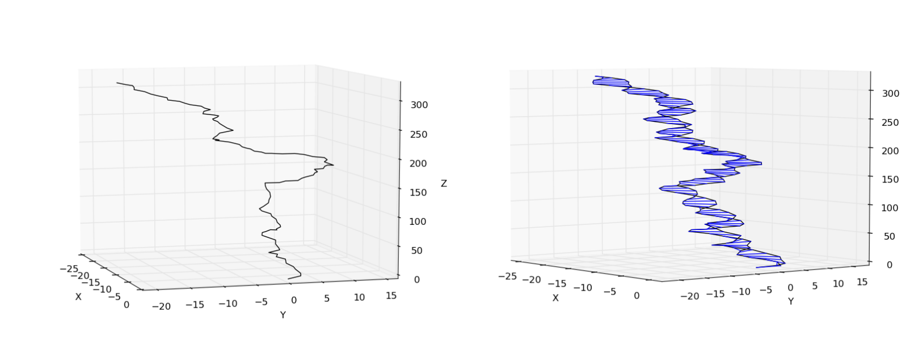

.. _tutorial:

################
HelixMC Tutorial
################

:Release: |version|
:Date: |today|

HelixMC is a software package for Monte-Carlo (MC) simulations of DNA/RNA
helices using the base-pair level model [CITE]. This type of coarse-grained
model bridges between simple elastic rod models and full-atom representations,
providing a resonably sophiscated and yet computationally tractable way to
model long DNA/RNA helices up to thousands and to evalute their mechanical
properties of base-pair. HelixMC has the utility of applying external stetching
and twisting forces to the terminal of the helix and measuring the end-to-end
distance and the rotation of the terminal base-pair (known as `linking number`)
during the process. This is exactly what has been done in recent single-molecule
tweezers experiments [CITE], making HelixMC a powerful tool for direct
simulation of these experiments.

HelixMC is coded in Python in an object-oriented fashion. Some core
computations are speeded up by wrapping in C++ codes using scipy.weave.
Therefore HelixMC provides a framework that is easy to use and extend, as well
as being resonable fast when it comes to large-scale computations.

This tutorial demonstrates how to install and run simple calculations with
HelixMC, and breifly summarizes the code organization, useful curated database,
and available examples. For details on the classes and functions availble,
please see :ref:`reference`.

Install
=======

Currently HelixMC has only been tested on Linux. It should run on other
Unix-like system (e.g. Mac OS X). The following packages are also required
to HelixMC. The versions we used are given in parathesis.

* Python (2.7.3)

* Numpy (1.6.1)

* Scipy (0.10.1)

* GCC (4.6.3, for scipy.weave)

The easiest way to setup the python environment is to use latest Enthought
Python Distribution (http://www.enthought.com/). HelixMC will probably run in
different environments but there is no gurantee for that.

The source code of HelixMC is hosted on GitHub. To download, simply run::

    $ git clone https://github.com/fcchou/HelixMC.git

Or you can go to https://github.com/fcchou/HelixMC/ and download to source code
by clicking the "ZIP" button on upper-left.

After this, add your HelixMC folder into the system's ``$PATH`` and
``$PYTHONPATH``. In bash this can be done by adding the following lines to your
``~/.bashrc``::

    export PATH=$PATH:<HelixMC Path>
    export PYTHONPATH=$PYTHONPATH:<HelixMC Path>

Then you should be all set. To test the install, simply run::

    $ helixmc-run --help

This should output the help information for `helixmc-run` application.

Run HelixMC
===========

The `helixmc-run` application wraps the classes and functions of HelixMC to
allow simple MC job submissions from command line.

A detailed help for all options of `helixmc-run` can be obtained by running::

    $ helixmc-run --help

Now we demonstrate a simple example for `helixmc-run`.

First, run the following command to kick out a MC run::

    $ helixmc-run -params_file <HelixMC Path>/database/DNA_default.npz \
      -n_bp 100 -n_step 10 -seq GCCG -force 5 -compute_fuller_link True \
      -out_frame test_run

Here, ``-params_file`` give the input database file that contains base-pair
step parameters curated from PDB. ``-n_bp`` is the total number of base-pairs
in the helix ``-n_step`` is the number of MC steps. ``-seq`` gives the sequence
of the nucleic acids (ATCG for DNA and AUCG for RNA). ``-force`` is the applied
z-direction stretching force. ``-compute_fuller_link`` tells HelixMC to compute
and store the linking number using Fuller's approximation [CITE].
``-out_frame`` option will make HelixMC save the final frame to disk as
``test_run.npz`` in this case.

Depending on your machine it will take a few seconds to run. After completion
you should see something like::

    Total time = 1.941772
    Accept rate = 0.787879

It is advisable to check the `Accept rate` of each run, and make sure it is not
too low. As a rule of thumb, if `Accept rate` < 0.1, this means most MC moves
are rejected, and you will need use a higher-than-normal number of MC steps to
acheive the same level of sampling.

Now we can analyze the output data. Open a Python session and enters
the following::

    >>> import numpy as np
    >>> import matplotlib.pyplot as plt
    >>> from helixmc.pose import HelixPose

The observables for each frame are stored in ``MC_data.npz``. Normally the
coordinates and reference frames of the last base-pair are recorded. If
``-compute_fuller_link`` or ``-compute_exact_link`` is set to True, the twist
and writhe of the helix will also be stored (note that link = twist + writhe).

For example I can compute the average z-extension and the average link
as follows::

    >>> data = np.load('MC_data.npz')
    >>> data.files
    ['coord_terminal', 'twist', 'writhe', 'frame_terminal']
    >>> data['coord_terminal'][:,2] #2 for the z-elements
    array([ 309.06198311,  317.92717085,  320.17158221,  304.42561971,
            319.07461907,  306.94162915,  314.7566295 ,  319.04106375,
            322.42125203,  325.72718993])
    >>> np.average(data['coord_terminal'][:,2]) #avg. z-extension in A
    315.95487393228649
    >>> np.average(data['twist'] + data['writhe']) #avg. link in radian
    60.648749666780688

Remember we stored the final frame of the simulation to ``test_run.npz``. We
will now plot the helix using that::
    
    >>> pose = HelixPose('test_run.npz')
    >>> pose.plot_centerline() #plot the centerline
    >>> pose.plot_helix() #plot the entire helix

You should see something like the following images

This is the end of the example. For more examples, check the ``examples/``
folder in HelixMC, which is briefly summarized below.

Other Examples
==============

Here is a list of examples in the ``examples/`` folder.

* force_extension: This is just the example above.

* link_constrained: This is for link-contrained simulation, similar to the
  torsioal-trap single-molecule experiment [CITE].

* z-dna: Simulation of Z-DNA using `helixmc-run`.

* fuller_check: Check the if the Fuller's approximation is correct in certain
  criteria.

* data_fitting: How to use `helixmc.fitfxn` to fit simulation or experiment
  data to simple analytical models.

* bending_Lp_Olson: How to perform alternative evaluation of bending persistence
  length using the method suggested by Olson et al. [CITE].

* database_curation: Examples on curating base-pair step parameters from PDB.

Base-pair Step Parameters Database
==================================

Code Organization
=================

References
==========
